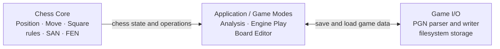

# Software Architecture

**Status:** Proposed target architecture

This document describes the intended structure of the chess application during and after the current refactoring. It explains how the main modules interact and where each responsibility belongs. Observable system behaviour and requirements are specified separately in [WorldMachineModel.md](WorldMachineModel.md).

## Architecture overview

The application uses a layered architecture arranged as three major areas:



The arrows show the runtime flow of capabilities and data. They do not represent C++ include dependencies.

## Chess Core

The Chess Core is the domain model and rules engine. It is independent of game modes, user interfaces, chess engines, PGN files, and the operating system.

### Responsibilities

- Represent a chess position.
- Represent moves, squares, pieces, colours, and game results.
- Validate candidate moves and apply legal moves.
- Detect check, checkmate, stalemate, and position-based draw conditions.
- Convert positions to and from FEN.
- Produce and interpret chess move notation such as SAN.

`Position` is the main entry point, but `Move` and `Square` are also public domain types. SAN is derived from a canonical `Move` and the position before that move.

## Application and game modes

The Application implements the user-facing use cases by coordinating the Chess Core. Each game mode owns the state and behaviour specific to that mode.

### Analysis

An analysis session represents positions as a tree:

- Every non-root node is reached by one canonical `Move` from its parent.
- A node may have multiple ordered children representing variations.
- One continuation at each branch is ranked first and therefore forms the mainline.

### Engine play

An engine-play session represents the played game as a linear history:

- The starting `Position`.
- An ordered sequence of canonical `Move` values.
- The resulting positions, either stored or reproducible from the starting position.
- The game result, player colours, clock state, and repetition history.
- Coordination with an engine API.

### Board editor

The board editor constructs or modifies a `Position` and validates it before another game mode uses it. It does not bypass the invariants required by the Chess Core.

### Shared rules

- Game modes store canonical `Move` values, not SAN strings, as their source of truth.
- SAN may be calculated when displaying or exporting a move and may be cached only as derived data.
- Game modes use Chess Core operations rather than implementing chess rules themselves.
- Analysis and engine play may use different data structures without duplicating PGN formatting or filesystem logic.

## Game I/O

The external import/export area is named **Game I/O**. It translates between application game data and PGN files.

Game I/O contains two distinct internal responsibilities:

1. **PGN codec**
   - Serializes a linear game or analysis tree into PGN text.
   - Parses PGN text into a neutral game representation that the Application can validate and load.
   - Preserves headers, results, comments, annotations, the mainline, and variations where supported.

2. **Filesystem storage**
   - Reads text from a requested path.
   - Writes generated text to a requested path.
   - Reports filesystem failures without changing the active application state.

Keeping these responsibilities separate inside Game I/O allows the PGN codec to be tested without touching the filesystem. It also permits PGN text to be copied to the clipboard, sent over a network, or stored elsewhere without changing chess or game-mode logic.

### Export flow

```text
Application game state
    -> PGN writer
    -> PGN text
    -> filesystem storage
    -> file
```

### Import flow

```text
file
    -> filesystem storage
    -> PGN text
    -> PGN parser
    -> validated game data
    -> Application game state
```

Import is transactional from the user's perspective: the Application replaces its active state only after the file has been read, the PGN has been parsed, and every reconstructed position has been validated successfully.

## APIs and dependency direction

In this document, an **API** is the public interface between layers: the contract one module exposes and another module calls.

- The Chess Core has no dependency on the Application or Game I/O.
- The Application depends on the Chess Core API and types.
- Application use cases initiate imports and exports through the Game I/O API.
- The Game I/O layer implements that API using its PGN codec and filesystem storage.
- The Application does not depend directly on operating-system filesystem APIs.

This separation allows the PGN codec, filesystem, engine integration, and user interface to change without changing chess rules.

## Proposed source layout

The final directory names may evolve, but responsibilities should remain separated along these boundaries:

```text
include/
    core/
    application/
        analysis/
        play/
        editor/
        api/
    io/
        pgn/
        filesystem/

src/
    core/
    application/
        analysis/
        play/
        editor/
    io/
        pgn/
        filesystem/
```
