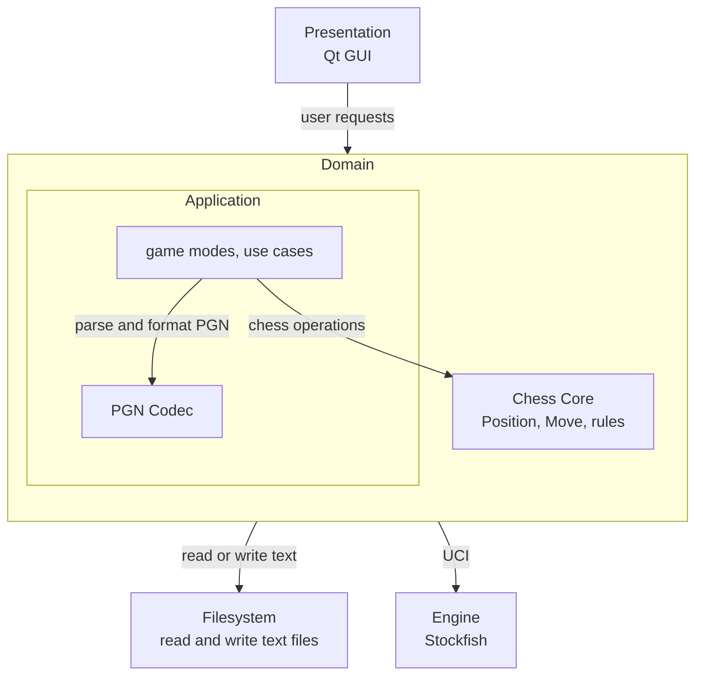

# Software Architecture

**Status:** Proposed layered target architecture

This document describes the intended structure of the chess application. It explains how the main modules interact and what their responsibilities are. Requirements and specifications of the application are specified separately in [WorldMachineModel.md](WorldMachineModel.md).

## Architecture overview

The application uses a closed layered architecture with three layers:

1. **Presentation** - the Qt GUI.
2. **Domain** - application use cases, game modes, PGN handling, and the Chess Core.
3. **Filesystem** - reading and writing text files.

Stockfish is an external process, not a module of this application. The Domain layer communicates with it over UCI.

Arrows in the diagram are dependencies and stay downward. Runtime notifications may go Application → GUI through an observer interface declared by Application.



The Application and Chess Core are separate modules within the Domain layer, not separate architecture layers.

## Presentation layer: GUI

The GUI is implemented with Qt and is responsible only for presentation and user interaction.

### Responsibilities

- Render boards, move histories, analysis variations, clocks, and other interface state.
- Convert user interaction into calls to the Application API.
- Display results and errors returned by the Application.
- Select file paths before requesting a PGN import/export.
- Copy and paste FEN text via the clipboard, and pass that string to the Application. The GUI does not parse FEN.
- Implements Application's observer interface and updates widgets when notified. Qt signals stay inside the Presentation layer.

Qt types must not appear in the public APIs of the Application, Chess Core, or Filesystem modules.

## Domain layer

The Domain layer contains the behaviour that defines the chess application. It is divided into the Application and Chess Core components.

### Application component

The Application exposes the use cases called by the GUI.

#### Responsibilities

- Creates game modes (Analysis, Engine Play) and owns their state.
- Responds to api calls from the GUI, updating game-state, exporting/importing, or reporting an error.
- Uses Chess Core to properly implement game modes and ensure they are in line with the rules of chess.
- Calls the Filesystem module api for PGN imports /exports.
- Handles coding/decoding from and to PGN format.
- Accepts a FEN string, asks Chess Core to parse and validate it, and applies the resulting position.
- Returns the currently viewed position as a FEN string.
- Declares the observer interface, holds a pointer to it, and calls it when session state changes (clock, engine move, game over).
- Launch and terminate the Stockfish process.
- Send UCI commands and parse UCI replies.
- Translate those replies into domain types the rest of Application already uses.


#### Rules

- Game modes store canonical `Move` instances, not SAN strings, as their source of truth.
- Import and export are Application use cases. The GUI/Filesystem layers don't construct or modify a game mode directly.
- FEN import and export do not go through the Filesystem layer.
- Only the Application talks to Stockfish.

### Chess Core

The Chess Core represents all necessary chess-related concepts and rules. It is independent from the rest of the application.

#### Responsibilities

- Represent a chess position.
- Represent moves, squares, pieces, colors, and game results.
- Validate candidate moves and apply legal moves.
- Detect check, checkmate, stalemate, and position-based draw conditions.
- Convert positions to and from FEN. Malformed or illegal FEN strings are rejected.

## Filesystem layer

The Filesystem layer is an intentionally small boundary around operating-system file access.

### Responsibilities

- Read all text from a requested path.
- Write text to a requested path.
- Translate low-level failures into a small, consistent error model.

## Import and export flows

Import and export are initiated through the Application API. This keeps both flows in the same downward dependency direction.

### PGN import

```text
GUI
    -> Application import use case
    -> Filesystem reads the file
    -> PGN parser produces a neutral PGN document
    -> Application replays and validates moves through the Chess Core
    -> Application builds a Game or Analysis session
    -> Application replaces active state only after every step succeeds
```

A PGN containing variations may be imported into Analysis mode but not into a linear Game mode. A failure to read, parse, or validate leaves the current application state unchanged.

### PGN export

```text
GUI
    -> Application export use case
    -> Application traverses canonical game or analysis state
    -> Chess Core produces notation where required
    -> PGN writer produces text
    -> Filesystem writes the text to the requested path
```

### FEN import

```text
GUI (clipboard string)
    -> Application calls Core
    -> Core parses and validates
    -> Application applies the position
    -> Application replaces state only on success
```

### FEN export

```text
GUI
    -> Application (currently viewed position)
    -> Core produces FEN text
    -> GUI places the string on the clipboard
```

## CMake targets structure

The intended CMake target direction is:

```text
chess_gui         -> chess_application
chess_application -> chess_core
chess_application -> chess_filesystem
chess_core         -> no project target
chess_filesystem   -> no project target
chess executable   -> composition and startup only
```

## Proposed source layout

The final directory names may evolve, but responsibilities should remain separated along these boundaries:

```text
docs/
scripts/
modules/
    application/
        include/application/
            api/
            analysis/
            play/
            editor/
        src/
            api/
            analysis/
            play/
            editor/
            pgn/
        CMakeLists.txt
    core/
        include/core/
            api/
            pieces/
        src/
            api/
            pieces/
        CMakeLists.txt
    filesystem/
        include/filesystem/
        src/
        CMakeLists.txt
    gui/
        include/gui/
        src/
        CMakeLists.txt
app/
    main.cpp
tests/
    CMakeLists.txt
    core/
    application/
CMakeLists.txt
README.md
```
